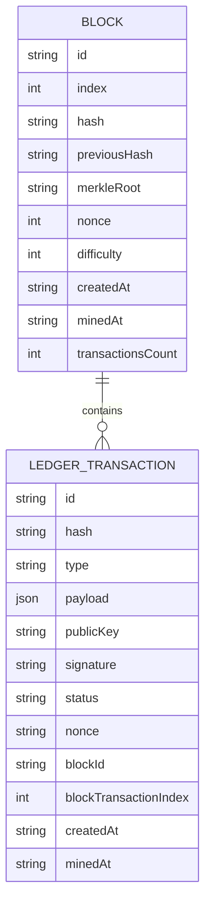
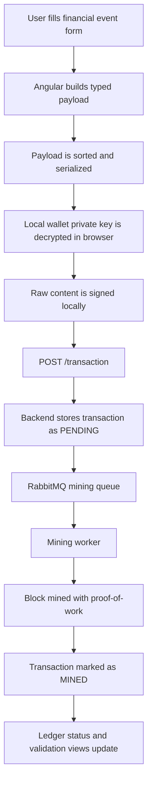
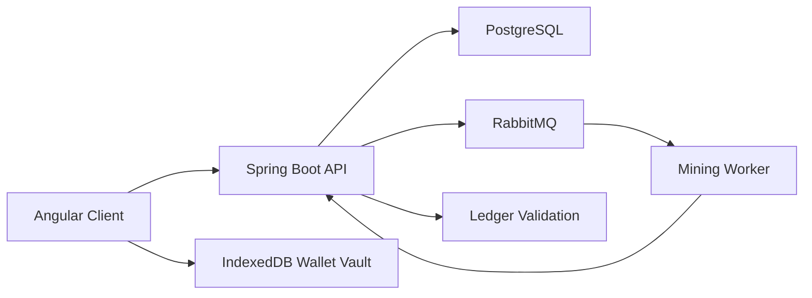
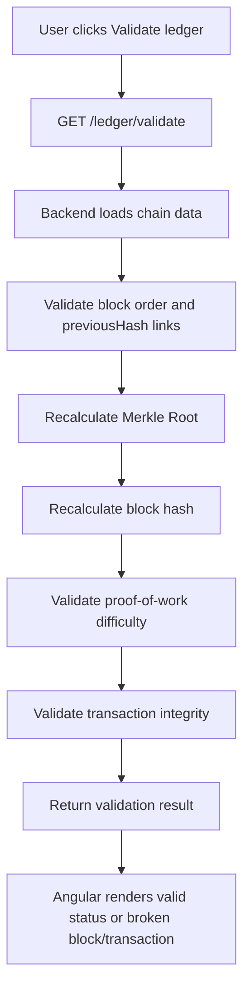

# Auditex Angular Client

[Leia em português brasileiro](./README.pt-BR.md)

Auditex is a financial audit ledger interface built with Angular, designed to create, sign, track, and validate tamper-evident financial workflow events.

It presents a corporate frontend for a centralized blockchain-backed audit ledger: financial events are signed locally, submitted to a backend ledger API, mined into proof-of-work blocks, and exposed through transaction and block explorers.

## Project Overview

Auditex is not a generic dashboard. It is a financial audit application focused on traceability, integrity validation, and operational evidence for billing and processing workflows.

The frontend currently supports:

- Signed financial event creation with a local encrypted wallet vault
- Ledger status monitoring and full-chain validation consumption
- Paginated transaction exploration with filters
- Paginated block exploration with block detail views
- Transaction detail inspection with payload, public key, signature, block metadata, and status
- Corporate financial UI with neutral surfaces, gold accents, metric cards, status badges, tables, and hash previews

## Why Auditex Exists

Financial processing systems often need to prove what happened, when it happened, which file or processing run was involved, and whether the audit trail was changed after the fact.

Auditex models that audit trail as signed financial events and exposes a ledger-oriented interface for:

- Compliance and audit review
- Billing file lifecycle traceability
- Processing integrity checks
- Divergence tracking
- Tamper-evident block and transaction inspection

## Core Features

| Area | Current frontend capability |
| --- | --- |
| Dashboard | Shows ledger integrity, block count, mined and pending transactions, latest block hash, and validation results |
| Event creation | Builds financial payloads, decrypts a local wallet key, signs the transaction, and sends it to `POST /transaction` |
| Ledger explorer | Lists transactions with pagination and filters by type, processing ID, and file hash |
| Transaction detail | Shows event metadata, status, payload JSON, public key, signature, nonce, block reference, and mining timestamps |
| Block explorer | Lists mined blocks with pagination, hashes, proof-of-work fields, Merkle Root, nonce, difficulty, and transaction count |
| Block detail | Shows a block and its paginated transaction list |
| Wallet vault | Creates wallets through the API, imports wallets, encrypts private keys locally, and stores them in IndexedDB |
| Validation | Calls the ledger validation endpoint and renders validation results returned by the backend |

## Domain Model

The frontend models the ledger using strongly typed TypeScript interfaces under `src/app/core/models`.



### Financial Event Types

Financial event types are defined in `src/app/core/models/financial-event/financial-event-type.ts`.

| Event type | Purpose |
| --- | --- |
| `BILLING_FILE_RECEIVED` | Registers receipt of a billing file |
| `BILLING_FILE_VALIDATED` | Records validation of a billing file |
| `BILLING_PROCESSING_STARTED` | Marks the beginning of a billing processing run |
| `BILLING_PROCESSING_FINISHED` | Records completion metrics for a processing run |
| `BILLING_CHARGE_CALCULATED` | Registers calculated charges |
| `BILLING_DIVERGENCE_DETECTED` | Records financial or record-level divergences |
| `BILLING_BATCH_APPROVED` | Marks a billing batch as approved |
| `BILLING_BATCH_REJECTED` | Marks a billing batch as rejected |
| `BILLING_REPORT_EXPORTED` | Registers export of a billing report |

### Payload Fields

The event form builds payloads from fields such as:

- `processingId`
- `fileHash`
- `fileName`
- `recordsCount`
- `recordsProcessed`
- `totalAmount`
- `currency`
- `source`
- `divergenceType`
- `expectedAmount`
- `actualAmount`
- `affectedRecords`
- `divergencesFound`
- `durationMs`
- `status`

The exact payload changes by event type. For example, divergence events include expected and actual amounts, while processing completion events include processed record count, duration, divergence count, and status.

## Financial Event Lifecycle



The frontend implements the browser-side steps: payload construction, local wallet lookup, private key decryption, signing, and API submission. The queueing, mining, block creation, and validation logic are backend responsibilities surfaced through API responses.

## Architecture



## Frontend Architecture

The Angular client uses standalone components, lazy loaded routes, signals for local state, typed services, and reusable shared UI components.

```text
src/
  app/
    core/
      enums/
      models/
      services/
    features/
      block/
      dashboard/
      ledger/
      transaction/
      wallet/
    shared/
      components/
      services/
      utils/
    app.config.ts
    app.routes.ts
  styles.scss
```

### Main Routes

| Route | Screen |
| --- | --- |
| `/dashboard` | Ledger overview and integrity validation |
| `/ledger` | Paginated financial event explorer |
| `/ledger/transaction/:hash` | Transaction detail |
| `/block` | Paginated block explorer |
| `/block/:id` | Block detail and block transaction list |
| `/event/create` | Signed financial event creation |
| `/wallet/create` | Wallet generation and local vault save |
| `/wallet/import` | Wallet import into the local vault |
| `/transaction/create` | Lazy route alias for transaction creation |

### Shared UI Components

Reusable components live under `src/app/shared/components`:

- `PageHeader`
- `SectionCard`
- `MetricCard`
- `StatusBadge`
- `HashValue`
- `JsonPreview`
- `EmptyState`

These components keep the audit UI consistent across dashboards, explorers, detail pages, and forms.

## Backend Integration

API access is centralized in Angular services under `src/app/core/services`.

| Service | Endpoints consumed |
| --- | --- |
| `TransactionService` | `GET /transaction`, `POST /transaction`, `GET /transaction/hash/{hash}`, `GET /transaction/type/{type}`, `GET /transaction/processing/{processingId}`, `GET /transaction/file/{fileHash}`, `GET /transaction/public-key?publicKey=...` |
| `BlockService` | `GET /block`, `GET /block/latest`, `GET /block/id/{id}`, `GET /block/{id}/transaction` |
| `LedgerService` | `GET /ledger/status`, `GET /ledger/validate` |
| `WalletService` | `POST /wallet` |

The client uses the singular endpoint names implemented in the services (`/transaction` and `/block`), not pluralized routes.

## API Consumption and Pagination

Ledger-scale data is consumed with pagination to avoid loading large transaction and block histories into the browser.

The shared `PageResponse<T>` model contains:

```ts
content: T[];
page: number;
size: number;
totalElements: number;
totalPages: number;
first: boolean;
last: boolean;
```

Current list screens use:

- Transaction ledger page size: `20`
- Block list page size: `20`
- Block detail transaction page size: `50`

## Local Signature Model

The event creation flow uses a local wallet stored in IndexedDB:

1. A wallet is created through `POST /wallet` or imported manually.
2. The private key is encrypted locally with AES-GCM.
3. The encryption key is derived from the user password using PBKDF2 and SHA-256.
4. The encrypted wallet is stored in IndexedDB in the `auditex-wallet-vault` database.
5. During event submission, the private key is decrypted in the browser using the local password.
6. The frontend builds raw content as:

```text
type + sortedSerializedPayload + publicKey + nonce
```

7. `SignatureService` signs the raw content using Web Crypto with `RSASSA-PKCS1-v1_5` and SHA-256.
8. The frontend sends only `type`, `payload`, `publicKey`, `signature`, and `nonce` to `POST /transaction`.

The private key is not sent to the backend by the transaction submission flow.

## Blockchain Validation Flow



The frontend does not recalculate the chain locally. It consumes the backend validation result through `LedgerService` and presents the integrity state to the user.

## Screens and User Flows

### Dashboard

The dashboard summarizes ledger health:

- Integrity state
- Total blocks
- Mined transactions
- Pending transactions
- Latest block index and hash
- Latest mining timestamp
- Manual validation action

### Financial Ledger

The ledger explorer supports paginated transaction review and filtering by:

- Event type
- Processing ID
- File hash

Rows expose event label, technical type, status badge, hash, public key, block reference, and mined timestamp.

### Transaction Detail

The transaction detail page focuses on audit evidence:

- Transaction hash
- Block ID and block transaction index
- Nonce
- Creation and mining timestamps
- Payload JSON
- Public key
- Signature
- Status badge

### Block Explorer

The block explorer shows proof-oriented metadata:

- Block index
- Current hash
- Previous hash
- Difficulty
- Nonce
- Transaction count
- Mining timestamp

### Block Detail

The block detail page exposes:

- Block hash
- Previous hash
- Merkle Root
- Nonce
- Difficulty
- Created and mined timestamps
- Paginated transactions contained in the block

### Wallet Screens

Wallet screens support:

- Creating a wallet through the backend
- Importing an existing wallet
- Saving a private key encrypted in the local browser vault
- Selecting a local wallet for transaction signing

There is no role-based authentication UI in the current frontend. Access control is a roadmap item.

## UI/UX Identity

Auditex uses a neutral corporate financial interface rather than a dark terminal or crypto-style visual language.

Design choices include:

- Light neutral surfaces for readability
- Gold as the primary accent for important actions and ledger highlights
- Restrained success, warning, pending, and error status colors
- Compact metric cards for executive overview
- Clean tables for repeated audit records
- Hash abbreviations with full-value tooltips
- JSON previews for payload inspection
- Status badges for lifecycle clarity

The visual direction is built for trust, compliance, and financial operations.

## Tech Stack

| Layer | Technology |
| --- | --- |
| Framework | Angular 21 |
| Language | TypeScript |
| State | Angular signals |
| Routing | Angular Router with lazy `loadComponent` routes |
| HTTP | Angular `HttpClient` with fetch |
| Local storage | IndexedDB for encrypted wallet vault |
| Browser crypto | Web Crypto API |
| Styling | SCSS with global design tokens |
| Tests | Angular unit-test builder with Vitest |
| Package manager | Yarn 1.22.22 |

## Environment Variables

`API_URL` is defined through Angular build configuration in `angular.json`.

| Configuration | API URL |
| --- | --- |
| Development / serve | `http://localhost:8080` |
| Production build | `https://api.auditex.joaopdias.dev.br` |

## Getting Started

Install dependencies:

```bash
yarn install
```

Start the local development server:

```bash
yarn start
```

Open:

```text
http://localhost:4200/
```

The frontend expects the Auditex backend API to be available at `http://localhost:8080` when running the development configuration.

## Available Scripts

These scripts come from `package.json`.

| Command | Description |
| --- | --- |
| `yarn ng` | Runs the Angular CLI |
| `yarn start` | Starts `ng serve` |
| `yarn build` | Builds the application |
| `yarn watch` | Builds in development watch mode |
| `yarn test` | Runs Angular unit tests with the configured unit-test builder and Vitest dependency |

## Testing

The project includes tests for services and components using Angular testing utilities and Vitest.

Examples of covered areas:

- HTTP services with `HttpTestingController`
- Paginated API requests and query parameters
- Component rendering states
- Inputs and visual status behavior for shared components
- Event creation page rendering and wallet-empty state

Run tests:

```bash
yarn test
```

## Build

Create a production build:

```bash
yarn build
```

Build output is generated under `dist/auditex`.

## Roadmap

- Merkle proof view per transaction
- Stronger search across hashes, addresses, and processing metadata
- Downloadable audit and validation reports
- Real file hashing before event submission
- Role-based access control and authenticated navigation
- Expanded dashboard metrics for audit operations
- Exportable chain validation evidence
- Dedicated UI for backend mining queue state

## Portfolio Highlights

- Angular frontend for a tamper-evident financial audit ledger
- Domain-driven modeling of signed financial workflow events
- Local wallet encryption and browser-side transaction signing
- Blockchain explorer UI with block, transaction, Merkle Root, nonce, and difficulty metadata
- Full-chain integrity validation consumption
- Paginated API consumption for ledger-scale data
- Corporate UI tailored to compliance-oriented financial systems
- Reusable standalone Angular components with focused unit tests

## License

No license file is currently defined in this frontend repository.
