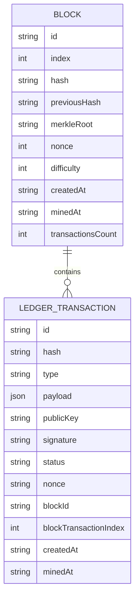
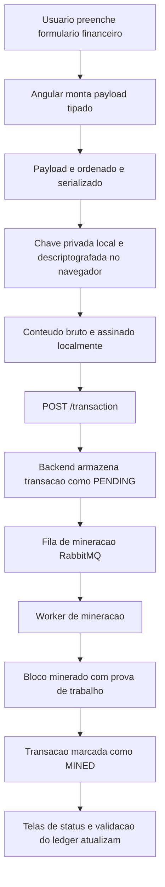
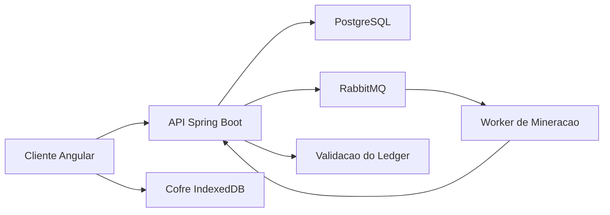
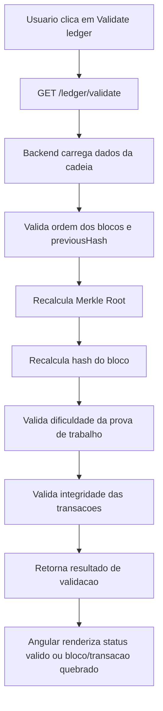

# Cliente Angular do Auditex

[Read in English](./README.md)

Auditex é uma interface de ledger auditável financeiro construída com Angular, criada para registrar, assinar, rastrear e validar eventos financeiros com evidência contra adulteração.

O frontend apresenta uma experiência corporativa para um ledger centralizado com base em blockchain: eventos financeiros são assinados localmente, enviados para uma API de ledger, minerados em blocos com prova de trabalho e disponibilizados em exploradores de transações e blocos.

## Visão Geral do Projeto

Auditex não é um dashboard genérico. É uma aplicação de auditoria financeira focada em rastreabilidade, validação de integridade e evidência operacional para fluxos de faturamento e processamento.

O frontend atualmente oferece:

- Criação de eventos financeiros assinados com cofre local de carteira criptografado
- Monitoramento do status do ledger e consumo da validação completa da cadeia
- Exploração paginada de transações com filtros
- Exploração paginada de blocos com tela de detalhe
- Inspeção de transação com payload, chave pública, assinatura, metadados de bloco e status
- UI financeira corporativa com superfícies neutras, acento dourado, cards de métrica, badges de status, tabelas e previews de hash

## Por Que o Auditex Existe

Sistemas de processamento financeiro frequentemente precisam provar o que aconteceu, quando aconteceu, qual arquivo ou execução esteve envolvida e se a trilha auditável foi alterada depois.

O Auditex modela essa trilha como eventos financeiros assinados e oferece uma interface orientada a ledger para:

- Revisão de auditoria e compliance
- Rastreabilidade do ciclo de vida de arquivos de faturamento
- Checagem de integridade de processamento
- Registro de divergências
- Inspeção de blocos e transações com evidência contra adulteração

## Funcionalidades Principais

| Área | Capacidade atual do frontend |
| --- | --- |
| Dashboard | Exibe integridade do ledger, quantidade de blocos, transações mineradas e pendentes, hash do último bloco e resultado de validação |
| Criação de evento | Monta payloads financeiros, descriptografa uma chave de carteira local, assina a transação e envia para `POST /transaction` |
| Explorador do ledger | Lista transações com paginação e filtros por tipo, processing ID e file hash |
| Detalhe da transação | Exibe metadados do evento, status, JSON do payload, chave pública, assinatura, nonce, referência de bloco e timestamps |
| Explorador de blocos | Lista blocos minerados com paginação, hashes, campos de prova de trabalho, Merkle Root, nonce, dificuldade e quantidade de transações |
| Detalhe do bloco | Exibe um bloco e sua lista paginada de transações |
| Cofre de carteira | Cria carteiras pela API, importa carteiras, criptografa chaves privadas localmente e armazena em IndexedDB |
| Validação | Chama o endpoint de validação do ledger e renderiza o resultado retornado pelo backend |

## Modelo de Domínio

O frontend modela o ledger com interfaces TypeScript tipadas em `src/app/core/models`.



### Tipos de Eventos Financeiros

Os tipos de eventos financeiros estão definidos em `src/app/core/models/financial-event/financial-event-type.ts`.

| Tipo de evento | Finalidade |
| --- | --- |
| `BILLING_FILE_RECEIVED` | Registra o recebimento de um arquivo de faturamento |
| `BILLING_FILE_VALIDATED` | Registra a validação de um arquivo de faturamento |
| `BILLING_PROCESSING_STARTED` | Marca o início de uma execução de processamento |
| `BILLING_PROCESSING_FINISHED` | Registra métricas de conclusão do processamento |
| `BILLING_CHARGE_CALCULATED` | Registra cobranças calculadas |
| `BILLING_DIVERGENCE_DETECTED` | Registra divergências financeiras ou de registros |
| `BILLING_BATCH_APPROVED` | Marca um lote de faturamento como aprovado |
| `BILLING_BATCH_REJECTED` | Marca um lote de faturamento como rejeitado |
| `BILLING_REPORT_EXPORTED` | Registra a exportação de um relatório de faturamento |

### Campos de Payload

O formulário de evento monta payloads a partir de campos como:

- `processingId`
- `fileHash`
- `fileName`
- `recordsCount`
- `recordsProcessed`
- `totalAmount`
- `currency`
- `source`
- `divergenceType`
- `expectedAmount`
- `actualAmount`
- `affectedRecords`
- `divergencesFound`
- `durationMs`
- `status`

O payload exato muda conforme o tipo de evento. Eventos de divergência incluem valores esperado e real, enquanto eventos de conclusão de processamento incluem quantidade processada, duração, quantidade de divergências e status.

## Ciclo de Vida do Evento Financeiro



O frontend implementa as etapas do navegador: montagem do payload, busca da carteira local, descriptografia da chave privada, assinatura e envio para a API. Enfileiramento, mineração, criação de blocos e validação são responsabilidades do backend expostas por respostas da API.

## Arquitetura



## Arquitetura do Frontend

O cliente Angular usa componentes standalone, rotas lazy loaded, signals para estado local, services tipados e componentes compartilhados de UI.

```text
src/
  app/
    core/
      enums/
      models/
      services/
    features/
      block/
      dashboard/
      ledger/
      transaction/
      wallet/
    shared/
      components/
      services/
      utils/
    app.config.ts
    app.routes.ts
  styles.scss
```

### Rotas Principais

| Rota | Tela |
| --- | --- |
| `/dashboard` | Visão geral do ledger e validação de integridade |
| `/ledger` | Explorador paginado de eventos financeiros |
| `/ledger/transaction/:hash` | Detalhe da transação |
| `/block` | Explorador paginado de blocos |
| `/block/:id` | Detalhe do bloco e lista de transações do bloco |
| `/event/create` | Criação de evento financeiro assinado |
| `/wallet/create` | Geração de carteira e salvamento no cofre local |
| `/wallet/import` | Importação de carteira para o cofre local |
| `/transaction/create` | Alias lazy para criação de transação |

### Componentes Compartilhados

Componentes reutilizáveis ficam em `src/app/shared/components`:

- `PageHeader`
- `SectionCard`
- `MetricCard`
- `StatusBadge`
- `HashValue`
- `JsonPreview`
- `EmptyState`

Eles mantêm a consistência visual entre dashboards, exploradores, telas de detalhe e formulários.

## Integração com Backend

O acesso à API é centralizado em services Angular em `src/app/core/services`.

| Service | Endpoints consumidos |
| --- | --- |
| `TransactionService` | `GET /transaction`, `POST /transaction`, `GET /transaction/hash/{hash}`, `GET /transaction/type/{type}`, `GET /transaction/processing/{processingId}`, `GET /transaction/file/{fileHash}`, `GET /transaction/public-key?publicKey=...` |
| `BlockService` | `GET /block`, `GET /block/latest`, `GET /block/id/{id}`, `GET /block/{id}/transaction` |
| `LedgerService` | `GET /ledger/status`, `GET /ledger/validate` |
| `WalletService` | `POST /wallet` |

O client usa os nomes singulares implementados nos services (`/transaction` e `/block`), não rotas no plural.

## Consumo da API e Paginação

Dados em escala de ledger são consumidos com paginação para evitar carregar grandes históricos de transações e blocos no navegador.

O modelo compartilhado `PageResponse<T>` contém:

```ts
content: T[];
page: number;
size: number;
totalElements: number;
totalPages: number;
first: boolean;
last: boolean;
```

As telas atuais usam:

- Página do ledger de transações: `20`
- Lista de blocos: `20`
- Lista de transações no detalhe do bloco: `50`

## Modelo de Assinatura Local

O fluxo de criação de evento usa uma carteira local armazenada em IndexedDB:

1. Uma carteira é criada por `POST /wallet` ou importada manualmente.
2. A chave privada é criptografada localmente com AES-GCM.
3. A chave de criptografia é derivada da senha do usuário com PBKDF2 e SHA-256.
4. A carteira criptografada é armazenada em IndexedDB no banco `auditex-wallet-vault`.
5. Durante o envio do evento, a chave privada é descriptografada no navegador usando a senha local.
6. O frontend monta o conteúdo bruto como:

```text
type + sortedSerializedPayload + publicKey + nonce
```

7. O `SignatureService` assina o conteúdo bruto com Web Crypto usando `RSASSA-PKCS1-v1_5` e SHA-256.
8. O frontend envia apenas `type`, `payload`, `publicKey`, `signature` e `nonce` para `POST /transaction`.

A chave privada não é enviada ao backend no fluxo de submissão de transação.

## Fluxo de Validação da Blockchain



O frontend não recalcula a cadeia localmente. Ele consome o resultado de validação do backend pelo `LedgerService` e apresenta o estado de integridade para o usuário.

## Telas e Fluxos de Usuário

### Dashboard

O dashboard resume a saúde do ledger:

- Estado de integridade
- Total de blocos
- Transações mineradas
- Transações pendentes
- Índice e hash do último bloco
- Timestamp da última mineração
- Ação manual de validação

### Ledger Financeiro

O explorador do ledger permite revisão paginada de transações e filtros por:

- Tipo de evento
- Processing ID
- File hash

As linhas exibem label do evento, tipo técnico, badge de status, hash, chave pública, referência de bloco e data de mineração.

### Detalhe da Transação

A tela de detalhe da transação foca na evidência auditável:

- Hash da transação
- ID do bloco e índice da transação dentro do bloco
- Nonce
- Timestamps de criação e mineração
- JSON do payload
- Chave pública
- Assinatura
- Badge de status

### Explorador de Blocos

O explorador de blocos mostra metadados orientados à prova:

- Índice do bloco
- Hash atual
- Hash anterior
- Dificuldade
- Nonce
- Quantidade de transações
- Timestamp de mineração

### Detalhe do Bloco

A tela de detalhe do bloco expõe:

- Hash do bloco
- Hash anterior
- Merkle Root
- Nonce
- Dificuldade
- Timestamps de criação e mineração
- Transações paginadas contidas no bloco

### Telas de Carteira

As telas de carteira permitem:

- Criar uma carteira pelo backend
- Importar uma carteira existente
- Salvar uma chave privada criptografada no cofre local do navegador
- Selecionar uma carteira local para assinar transações

Não há UI de autenticação por perfil ou permissões no frontend atual. Controle de acesso é item de roadmap.

## Identidade Visual e UX

Auditex usa uma interface financeira corporativa e neutra, evitando linguagem visual de terminal escuro ou cripto experimental.

Escolhas de design:

- Superfícies claras e neutras para legibilidade
- Dourado como acento principal para ações importantes e destaques do ledger
- Cores controladas para status de sucesso, alerta, pendência e erro
- Cards compactos de métrica para visão executiva
- Tabelas limpas para registros auditáveis
- Hashes abreviados com tooltip do valor completo
- Preview de JSON para inspeção de payload
- Badges de status para clareza do ciclo de vida

A direção visual é pensada para confiança, compliance e operações financeiras.

## Stack Técnica

| Camada | Tecnologia |
| --- | --- |
| Framework | Angular 21 |
| Linguagem | TypeScript |
| Estado | Angular signals |
| Rotas | Angular Router com rotas lazy via `loadComponent` |
| HTTP | Angular `HttpClient` com fetch |
| Armazenamento local | IndexedDB para cofre criptografado de carteiras |
| Criptografia no navegador | Web Crypto API |
| Estilos | SCSS com tokens globais de design |
| Testes | Angular unit-test builder com Vitest |
| Gerenciador de pacotes | Yarn 1.22.22 |

## Variáveis de Ambiente

`API_URL` é definido pela configuração de build Angular em `angular.json`.

| Configuração | API URL |
| --- | --- |
| Desenvolvimento / serve | `http://localhost:8080` |
| Build de produção | `https://api.auditex.joaopdias.dev.br` |

## Como Rodar

Instale as dependências:

```bash
yarn install
```

Suba o servidor local:

```bash
yarn start
```

Acesse:

```text
http://localhost:4200/
```

Em desenvolvimento, o frontend espera que a API backend do Auditex esteja disponível em `http://localhost:8080`.

## Scripts Disponíveis

Estes scripts vêm do `package.json`.

| Comando | Descrição |
| --- | --- |
| `yarn ng` | Executa o Angular CLI |
| `yarn start` | Inicia `ng serve` |
| `yarn build` | Compila a aplicação |
| `yarn watch` | Compila em modo watch de desenvolvimento |
| `yarn test` | Executa os testes unitários Angular com o builder configurado e dependência do Vitest |

## Testes

O projeto possui testes para services e components usando utilitários de teste do Angular e Vitest.

Exemplos de áreas cobertas:

- Services HTTP com `HttpTestingController`
- Requisições paginadas e parâmetros de query
- Estados de renderização de componentes
- Inputs e comportamento visual de status em componentes compartilhados
- Renderização da página de criação de evento e estado sem carteira

Execute:

```bash
yarn test
```

## Build

Crie um build de produção:

```bash
yarn build
```

O resultado é gerado em `dist/auditex`.

## Roadmap

- Prova de Merkle por transação
- Busca mais robusta por hashes, endereços e metadados de processamento
- Relatórios de auditoria e validação para download
- Hash real de arquivo antes da submissão do evento
- Controle de acesso baseado em papéis e navegação autenticada
- Evolução das métricas do dashboard para operações de auditoria
- Evidência exportável de validação da cadeia
- UI dedicada para estado da fila de mineração no backend

## Destaques para Portfólio

- Frontend Angular para um ledger financeiro auditável e resistente a adulteração
- Modelagem orientada a domínio para eventos financeiros assinados
- Criptografia local de carteira e assinatura de transações no navegador
- UI de explorador blockchain com bloco, transação, Merkle Root, nonce e dificuldade
- Consumo da validação completa de integridade da cadeia
- Consumo paginado de API para dados em escala de ledger
- Interface corporativa voltada a sistemas financeiros e de compliance
- Componentes Angular standalone reutilizáveis com testes unitários focados

## Licença

Não há arquivo de licença definido atualmente neste repositório frontend.
